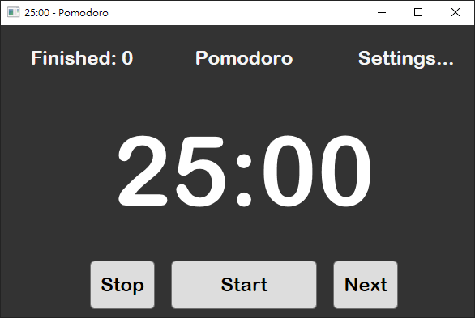

# Pomodoro

Pomodoro is a simple and small application for [Pomodoro Technique](https://en.wikipedia.org/wiki/Pomodoro_Technique) that helps improve productivity.

## Screenshot

## Features

- simple functionality and fewer distractions
- finished pomodoros are counted to help refine time management
- customize your Pomodoro timer by setting the length of intervals and the number of pomodoros pre-round

## Build

- Visual Studio 2022
- .Net 6.0
